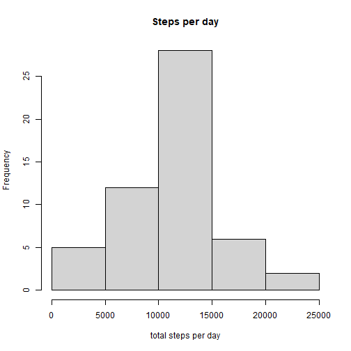
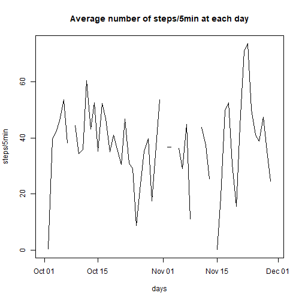
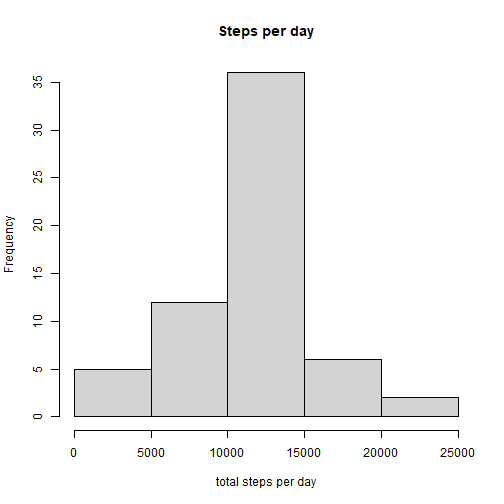
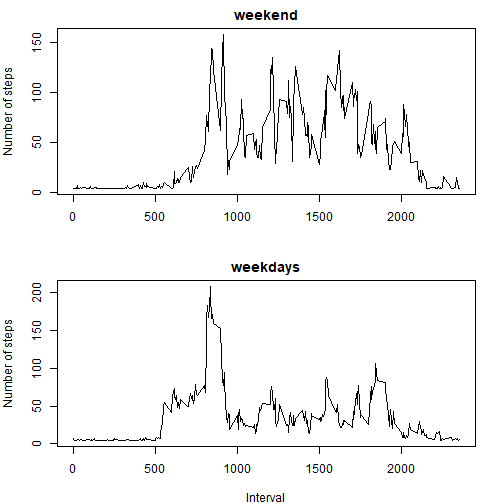

## Loading and preprocessing the data

Unzip the activity file and read data
```{r} knitr::opts_chunk$set(echo = FALSE)
unzip("activity.zip")
```


```r
list.files()
```

```
##  [1] "activity.csv"                  "activity.zip"                 
##  [3] "doc"                           "Figure1.png"                  
##  [5] "Figure2.png"                   "Figure3.png"                  
##  [7] "Figure4.png"                   "Figure5.png"                  
##  [9] "instructions_fig"              "PA1_template.html"            
## [11] "PA1_template.Rmd"              "README.md"                    
## [13] "RepData_CourseProject1.Rmd"    "RepData_PeerAssessment1.Rproj"
```

```r
data<-read.csv("activity.csv")
```

Load the dependencies and convert data into tibble

```r
suppressMessages(library(tidyr))
suppressWarnings(suppressMessages(library(dplyr)))
data<-tibble::as_tibble(data)
```

Let's take a brief look at the structure of the data:

```r
str(data)
```

```
## tibble [17,568 x 3] (S3: tbl_df/tbl/data.frame)
##  $ steps   : int [1:17568] NA NA NA NA NA NA NA NA NA NA ...
##  $ date    : chr [1:17568] "2012-10-01" "2012-10-01" "2012-10-01" "2012-10-01" ...
##  $ interval: int [1:17568] 0 5 10 15 20 25 30 35 40 45 ...
```

```r
summary(data)
```

```
##      steps            date              interval     
##  Min.   :  0.00   Length:17568       Min.   :   0.0  
##  1st Qu.:  0.00   Class :character   1st Qu.: 588.8  
##  Median :  0.00   Mode  :character   Median :1177.5  
##  Mean   : 37.38                      Mean   :1177.5  
##  3rd Qu.: 12.00                      3rd Qu.:1766.2  
##  Max.   :806.00                      Max.   :2355.0  
##  NA's   :2304
```

Our data frame includes 17568 observations of 3 variables (steps, date and interval). 2304 values for steps are NA's.

## What is mean total number of steps taken per day?

First let's group the data by day and plot the histogram for total steps per day:

```r
data_byday<-group_by(data, date)
steps_byday<-summarize(data_byday, dailysteps=sum(steps))

hist(steps_byday$dailysteps, main="Steps per day", xlab="total steps per day")
```



Then let's look at the mean and median of the total number of steps taken per day:

```r
summary(steps_byday)
```

```
##      date             dailysteps   
##  Length:61          Min.   :   41  
##  Class :character   1st Qu.: 8841  
##  Mode  :character   Median :10765  
##                     Mean   :10766  
##                     3rd Qu.:13294  
##                     Max.   :21194  
##                     NA's   :8
```

The mean and median of the total number of steps taken per day are nearly the same, 10766 and 10765 respectively.

## What is the average daily activity pattern?

Now we will explore the average daily activity pattern by looking at the time series data for average number of steps per 5 min intervals across all days.


```r
av5minsteps_byday<-summarize(data_byday, fiveminsteps=ave(steps, na.rm=TRUE), .groups="drop")

with(unique(av5minsteps_byday), plot(as.Date(date), fiveminsteps, type="l", main="Average number of steps/5min at each day", xlab="days", ylab="steps/5min"))
```



The average daily activity peaks at a day between November 15 and December 1. Let us find the date for most active day exactly: 

```r
MostActiveDay<-filter(unique(av5minsteps_byday), fiveminsteps==max(fiveminsteps,na.rm=TRUE))
MostActiveDay$date
```

```
## [1] "2012-11-23"
```

```r
MostActiveDay$fiveminsteps
```

```
## [1] 73.59028
```

The most active day was November 23, 2012, with an average of 73.6 steps per 5 minutes.

## Imputing missing values

Since there are 2304 missing values in our data, this may introduce some bias in analysis. Therefore let us impute the missing values an reanalyze the data.

First let us chek again the number of NA's in data.

```r
sum(is.na(data$steps))
```

```
## [1] 2304
```


Now we will add to data a new column "impsteps" at which the NA's in steps for 5 minute intervals are imputed by assigning the average of steps/5 min at that day from the table av5minsteps_byday:

```r
data$impsteps<-data$steps
for (i in 1:17568){ 
if (is.na(data[i,4])) data[i,4]<-av5minsteps_byday[i,2]
else data[i,4]<-data[i,4]
}
```

Despite this imputation, none of the NA's were replaced by average values, as the number of NA's is still 2304 in the impsteps colums:


```r
sum(is.na(data$impsteps))
```

```
## [1] 2304
```

This is because the values for steps/5 min intervals are either all numeric or all NA's for individual days.

So we will impute the days at which average number of steps/5min are all NA's by setting their values to the mean of the average values for the 5 min steps for all dates. And we will save the data into a new table "dataimp".


```r
dataimp<-data
m<-round(mean(av5minsteps_byday$fiveminsteps,na.rm=TRUE),digits=0)
for (i in 1:17568){ 
if (is.na(dataimp[i,4])) dataimp[i,4]<-m
}
```

Since all the NA's are imputed now, let us make a histogram of the total number of steps taken each day again:


```r
dataimp_byday<-group_by(dataimp, date)
stepsimp_byday<-summarize(dataimp_byday, dailysteps=sum(impsteps))

hist(stepsimp_byday$dailysteps, main="Steps per day", xlab="total steps per day")
```



To see how imputing affected data, let us investigate the mean and median of imputed data:


```r
summary(stepsimp_byday)
```

```
##      date             dailysteps   
##  Length:61          Min.   :   41  
##  Class :character   1st Qu.: 9819  
##  Mode  :character   Median :10656  
##                     Mean   :10752  
##                     3rd Qu.:12811  
##                     Max.   :21194
```

Imputing the data caused a slight decrease in the mean and median of the total number of steps taken per day. The median of the total number of steps taken per day decreased to 10656, and the mean of the total number of steps taken per day decreased to 10752. 

## Are there differences in activity patterns between weekdays and weekends?

First we will create a new factor variable in the dataset with two levels -- "weekday" and "weekend" indicating whether a given date is a weekday or weekend day :


```r
dataimp$wday<-weekdays(as.Date(dataimp$date))
weekdays1 <- c('Monday', 'Tuesday', 'Wednesday', 'Thursday', 'Friday')
dataimp$WDay <- factor((dataimp$wday %in% weekdays1), levels=c(TRUE, FALSE), labels=c('weekday', 'weekend'))
```

Then let us create two tables one for weekdays and one for the weekend, via grouping the data by factor variable, and these two tables will have a new column "fiveminsteps" listing the average number of steps in each 5-minute interval, for each day.


```r
dataimp_byinterval_weekday<-group_by(filter(dataimp, WDay=="weekday"),interval)
av5minsteps_byinterval_weekday<-unique(summarize(dataimp_byinterval_weekday, fiveminsteps=ave(impsteps, na.rm=TRUE),interval=interval, .groups="drop"))

dataimp_byinterval_weekend<-group_by(filter(dataimp, WDay=="weekend"),interval)
av5minsteps_byinterval_weekend<-unique(summarize(dataimp_byinterval_weekend, fiveminsteps=ave(impsteps, na.rm=TRUE),interval=interval, .groups="drop"))
```

Now we will plot time series plot of the 5-minute interval and the average number of steps taken, averaged across all weekday days or weekend days:


```r
par(mfrow=c(2,1), mar=c(4,4,2,2))

with (av5minsteps_byinterval_weekend,plot(interval, fiveminsteps, type="l", main="weekend", xlab="", ylab="Number of steps"))

with (av5minsteps_byinterval_weekday,plot(interval, fiveminsteps, type="l", main="weekdays",  xlab="Interval", ylab="Number of steps"))
```



The number of steps for the intervals 500-1000 are generally higher in the weekdays. But for the rest of intervals the number of steps are generally higher at the weekend days.
